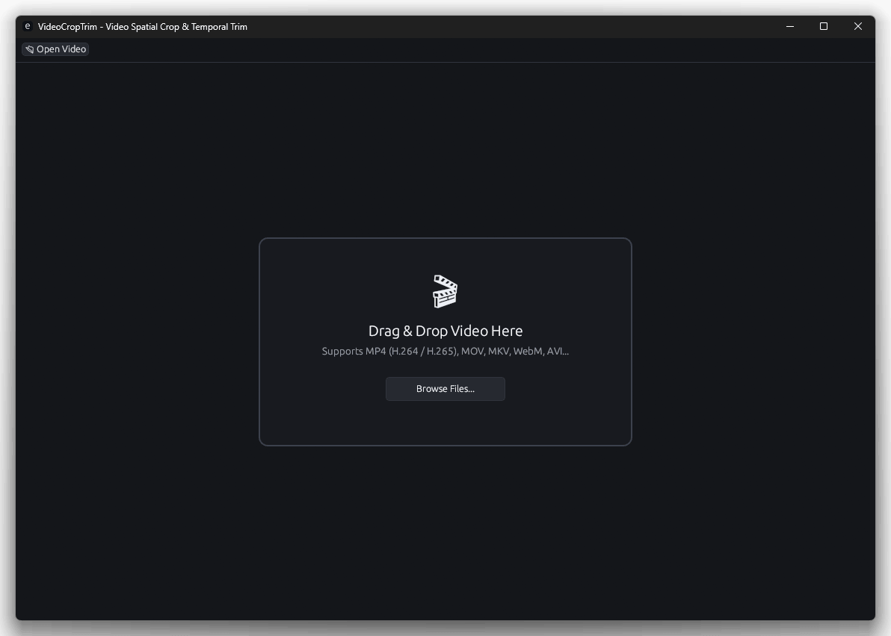
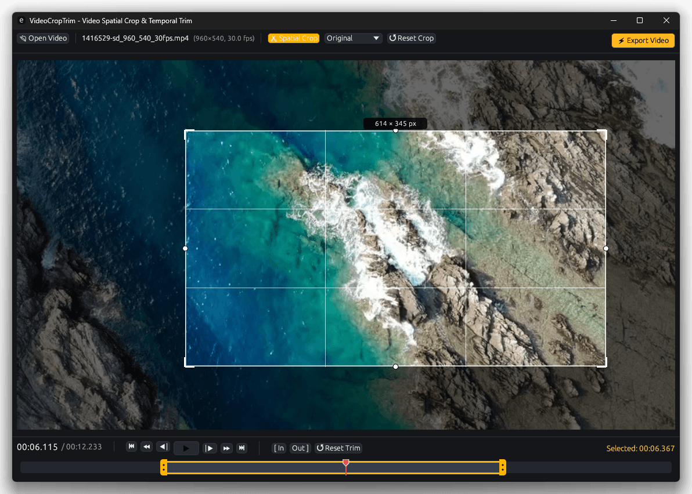
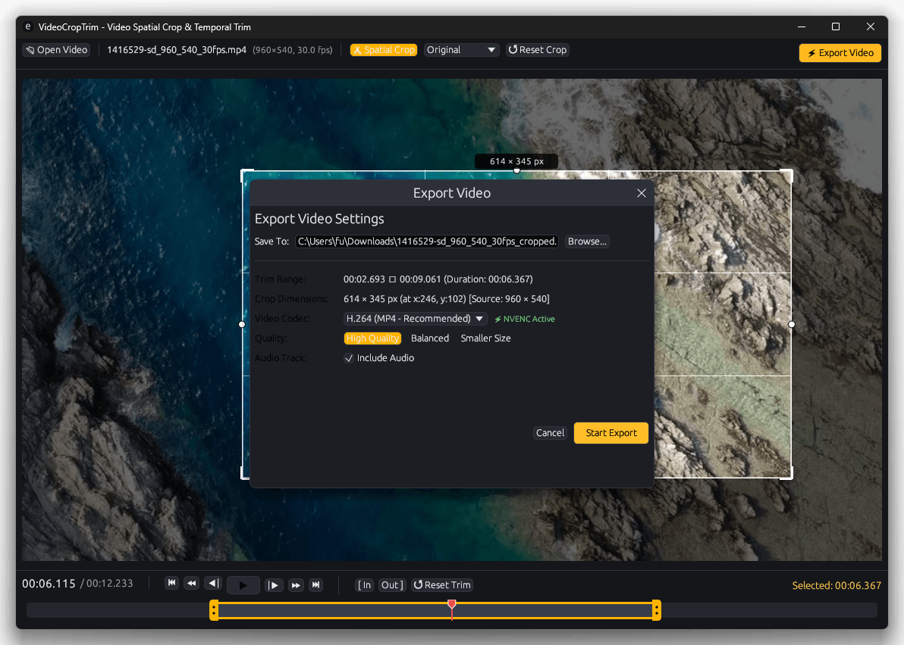

# VideoCropTrim

<table>
<tr>
<td></td>
<td></td>
<td></td>
</tr>
</table>

Video crop & trim app (made with Rust, works on Win/Mac/Linux)

> [!Note]
> Codes are generated by Antigraivty IDE. Please use with care.

## Requirements

- FFmpeg (`ffmpeg` and `ffprobe`) must be installed and available in your PATH.
  - For windows users: for example, use [btbn/ffmpeg-builds](https://github.com/btbn/ffmpeg-builds/releases)
  - For mac/linux users: `brew install ffmpeg` or `sudo apt install ffmpeg` etc.

## Screenshots

## License

0BSD (see [LICENSE](LICENSE))
